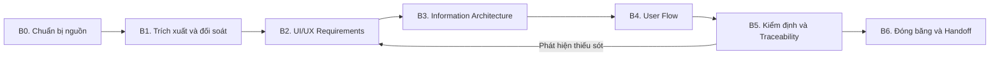

# QUY TRÌNH XÂY DỰNG BỘ TÀI LIỆU UI/UX — DEVRADAR

> Phạm vi: quy trình 6 giai đoạn (B0–B6) để tạo ra 3 tài liệu **UI/UX Requirements**, **Information Architecture**, **User Flow**
> từ (1) source code 6 services và (2) hai tài liệu đính kèm SRS/SDD.
> Bộ prompt kèm theo: [PROMPT_UIUX.md](PROMPT_UIUX.md) — Template: [templates/](templates/).

---

## 0. Tổng quan quy trình



**Nguyên tắc xuyên suốt**

1. **Code là nguồn chân lý số 1.** SRS/SDD là nguồn nghiệp vụ; khi mâu thuẫn với code (port, endpoint, hành vi thật) thì ghi `[CONFLICT]`, không tự ý "hợp thức hóa".
2. **Mọi thứ phải truy vết được.** Mỗi SCR/UX/IA/FLW đều có cột tham chiếu UC-xx (SRS 2.4.1) và endpoint (API_Documentation.md / api_analysis.md).
3. **Không che trạng thái.** Chức năng chưa có backend ghi rõ `[PLANNED]`; mâu thuẫn ghi `[CONFLICT]` vào mục "Vấn đề mở".
4. **Sơ đồ bằng Mermaid** trong markdown (đúng chuẩn repo); nếu cần đưa vào Word luận văn thì render Kroki/PlantUML như pipeline sẵn có trong `ai/scripts/`.
5. **Mỗi giai đoạn có DoD (Điều kiện hoàn thành)** — không sang giai đoạn sau khi DoD chưa đạt.

**Phân vai tối thiểu**

| Vai | Trách nhiệm | Ở đây là ai |
|---|---|---|
| Người giữ nguồn (Source Owner) | Chốt nguồn, quyết xử lý `[CONFLICT]` | Sinh viên/chủ dự án |
| Tác giả tài liệu (Author) | Chạy B1–B4, viết SCR/UX/IA/FLW | AI agent (bộ prompt P0–P3) |
| Kiểm định (Reviewer) | Chạy B5 bằng prompt P4, ký duyệt | Người + AI agent phiên khác (tốt nhất) |

---

## 1. Giai đoạn B0 — Chuẩn bị nguồn

| Mục | Nội dung |
|---|---|
| **Mục tiêu** | Đóng băng bộ nguồn đầu vào, tạo thư mục làm việc, thống nhất quy ước ID. |
| **Input** | Repo tại commit hiện tại; `ai/srs/DevRadar_SRS.docx`; `ai/sdd/DevRadar_SDD.docx`. |
| **Việc làm** | 1. Ghi lại commit hash của repo + các submodule (services/*) làm "phiên bản nguồn".<br>2. Tạo thư mục: `ai/uiux/`, `ai/uiux/working/`, `ai/uiux/extracted/`, `ai/uiux/validation/`.<br>3. Trích text .docx (python-docx hoặc `unzip -p … word/document.xml`) ra `ai/uiux/extracted/SRS_full.txt`, `SDD_full.txt` (giữ tiêu đề dạng `#` + bảng dạng `|`).<br>4. Chốt quy ước ID: **SCR-xx** (màn hình), **UX-xx** (yêu cầu), **IA-xx** (node thông tin), **FLW-xx** (luồng); tham chiếu UC-xx, FR-xx theo catalog sẵn có. |
| **Output** | `ai/uiux/extracted/*.txt`; ghi chú phiên bản nguồn ở đầu mỗi tài liệu (mục "Thông tin tài liệu"). |
| **Công cụ** | Python 3 + python-docx (đã cài trong máy); git. |
| **DoD** | ✅ Hai file .txt tồn tại, mở được, đủ bảng 81 UC (SRS) và Phần 5 (SDD). ✅ Thư mục working/validation đã tạo. |

> Gợi ý lệnh trích (đã dùng thành công trong dự án):
> ```bash
> python -c "import docx; d=docx.Document('ai/srs/DevRadar_SRS.docx'); [print(p.text) for p in d.paragraphs]" > ai/uiux/extracted/SRS_full.txt
> ```

---

## 2. Giai đoạn B1 — Trích xuất Feature Map và đối soát nguồn

| Mục | Nội dung |
|---|---|
| **Mục tiêu** | Có một bảng "bản đồ tính năng" trung gian: UC ↔ API thật ↔ vai trò ↔ trạng thái nguồn. Đây là nền của cả 3 tài liệu. |
| **Input** | `extracted/SRS_full.txt` (bảng 81 UC, RBAC 4.2, MoSCoW 2.2); `services/GatewayService/API_Documentation.md`; `ai/source_analysis/api_analysis.md`; `ai/traceability/requirement_traceability.xlsx`; Postman collection; `docker-compose.yml`. |
| **Việc làm** | 1. Gom 81 UC thành nhóm màn hình (theo 5 cụm SRS Chương 4 + nhóm Hồ sơ/Thông báo/Bookmark/Xếp hạng/AI Assistant).<br>2. Với từng UC: tìm endpoint thật (api_analysis.md) → đánh dấu [IMPLEMENTED]; không thấy endpoint → [PLANNED].<br>3. Ghi nhận các mâu thuẫn đã biết: port SRS (Identity 5001, Community 5002, Analytics 8001, Quality 8002) ≠ thực tế (5002, 5145, 5003, 8000, 8001); SRS tách "AnalyticsService" nhưng thực tế analytics nằm trong CrawlerGithubService; DATN nhắc Angular trong khi CORS chỉ mở 3000/5173 (React/Vite); tính năng "đăng bài ẩn danh" trong tài liệu mẫu nhưng code dùng AuthorId JWT.<br>4. Ghi chú hành vi đặc biệt cần phản ánh vào UX: refresh token 1 lần dùng; `POST /community/api/Posts` trả 201; envelope `{isSuccess, message, data, code}`; rate limit 300/phút (crawler 60/phút); SignalR xác thực bằng `?access_token=`; QualityService tự ẩn nội dung toxicity cao và đẩy sự kiện `pending-report-received` cho admin. |
| **Output** | `ai/uiux/working/feature_map.md` — bảng: UC-xx | Tên | Tác nhân | Endpoint | Event SignalR | Trạng thái | Ghi chú conflict. |
| **DoD** | ✅ 81/81 UC xuất hiện trong feature_map (gộp dòng được, không được mất dòng). ✅ Mọi dòng có endpoint hoặc [PLANNED]. ✅ Mục "Conflicts" liệt kê đủ các mâu thuẫn ở bước 3. |

---

## 3. Giai đoạn B2 — Viết tài liệu UI/UX Requirements

| Mục | Nội dung |
|---|---|
| **Mục tiêu** | Chuyển feature_map thành yêu cầu UI/UX kiểm thử được (SCR-xx, UX-xx). |
| **Input** | `working/feature_map.md` + nguồn B0. |
| **Việc làm** | Chạy **Prompt P1** ([PROMPT_UIUX.md §2](PROMPT_UIUX.md)). Sau đó người duyệt rà: persona đủ 5 tác nhân; screen inventory phủ 14 nhóm UC; mỗi UX-xx có Given/When/Then; RBAC mở rộng tới mức SCR. |
| **Output** | `ai/uiux/UIUX_Requirements.md` (theo `templates/UIUX_Requirements_template.md`). |
| **DoD** | ✅ ≥ 18 SCR, ≥ 25 UX-xx. ✅ 100% UX-xx có: phân quyền, endpoint/[PLANNED], 4 trạng thái màn hình. ✅ Bảng traceability UX↔SCR↔UC đầy đủ. |

**Mẹo chất lượng:** bắt đầu từ nhóm "Xác thực" và "Bảng tin" (Must Have theo MoSCoW), làm nhóm Admin sau; giữ tên trường dữ liệu đúng như API (`title`, `content`, `upvoteCount`, `reputationScore`…) để frontend dùng được ngay.

---

## 4. Giai đoạn B3 — Dựng Information Architecture

| Mục | Nội dung |
|---|---|
| **Mục tiêu** | Cấu trúc sitemap + điều hướng theo vai trò, khớp với mô hình Menus API của IdentityService (menu cấu hình theo role trong DB). |
| **Input** | `UIUX_Requirements.md` (B2) + api_analysis.md §2.3 (Menus API) + RBAC SRS 4.2. |
| **Việc làm** | Chạy **Prompt P2** ([PROMPT_UIUX.md §3](PROMPT_UIUX.md)). Rà: sâu ≤ 3 cấp; không node mồ côi; Admin Console tách khỏi sidebar người dùng; mọi node có nguồn dữ liệu. |
| **Output** | `ai/uiux/Information_Architecture.md` (theo `templates/InformationArchitecture_template.md`). |
| **DoD** | ✅ Sitemap Mermaid render được; ma trận IA↔vai trò khớp RBAC; 14 nhóm UC đều có node. |

**Lưu ý:** vì frontend còn trống, mọi URL/route trong IA là **đề xuất** — ghi chú rõ để không bị hiểu là thiết kế đã chốt.

---

## 5. Giai đoạn B4 — Vẽ User Flow

| Mục | Nội dung |
|---|---|
| **Mục tiêu** | Mô tả hành trình người dùng qua màn hình + API + sự kiện realtime, có nhánh lỗi đầy đủ. |
| **Input** | B2 + B3 + `scripts/run-tests.ps1` (happy path đã kiểm chứng) + đặc tả 14 tiến trình SRS Chương 3 + Postman. |
| **Việc làm** | Chạy **Prompt P3** ([PROMPT_UIUX.md §4](PROMPT_UIUX.md)). Rà: mỗi FLW có ≥ 2 nhánh lỗi; luồng ghi (đăng bài/bình luận) bắt buộc có nhánh kiểm duyệt AI; luồng refresh/logout phản ánh refresh token 1 lần dùng; có mục luồng ngang (401→refresh, 429, SignalR mất kết nối). |
| **Output** | `ai/uiux/User_Flow.md` (theo `templates/UserFlow_template.md`). |
| **DoD** | ✅ ≥ 12 FLW phủ 14 tiến trình SRS Chương 3. ✅ 100% luồng có nhánh lỗi; Mermaid render được. |

**Mẹo chất lượng:** luồng "hạnh phúc" lấy từ run-tests.ps1 để đảm bảo khả thi qua API thật; luồng moderation phải khớp chuỗi sự kiện thật: `post-created` → QualityService analyze → toxicity cao → ẩn + `pending-report-received` → admin duyệt.

---

## 6. Giai đoạn B5 — Kiểm định và Traceability

| Mục | Nội dung |
|---|---|
| **Mục tiêu** | Bắt lỗi bằng phiên mắt thứ hai; khóa bảng traceability 2 chiều. |
| **Việc làm** | 1. Chạy **Prompt P4** ([PROMPT_UIUX.md §5](PROMPT_UIUX.md)) → báo cáo `ai/uiux/validation/uiux_review_report.md`.<br>2. Với mỗi lỗi Blocker/Major: quay lại đúng giai đoạn sinh ra nó (B2/B3/B4) và chạy lại prompt đó với ghi chú sửa.<br>3. Kiểm tra 2 chiều: (a) mọi UC trong feature_map được ≥ 1 mục tài liệu trỏ tới; (b) mọi tham chiếu UC trong tài liệu có thật trong SRS 2.4.1.<br>4. (Tuỳ chọn) Cập nhật `ai/traceability/requirement_traceability.xlsx` thêm cột UX/SCR/IA/FLW bằng openpyxl, theo mẫu catalog sẵn có. |
| **Output** | `ai/uiux/validation/uiux_review_report.md`; traceability cập nhật. |
| **DoD** | ✅ 0 Blocker, 0 Major; các Minor được ghi nhận có lịch sửa. ✅ 100% UC 14 nhóm được phủ 2 chiều. |

**Checklist nhanh cho người duyệt (không qua AI):**
- Đọc 3 tài liệu lần lượt 10 phút: có thấy chức năng nào "đang cần" mà không tìm được màn hình/luồng không?
- Thử 2 câu hỏi ngẫu nhiên kiểu "Guest muốn xem bảng xếp hạng → bấm từ đâu?" (kiểm IA) và "Bài viết của tôi bị ẩn sau khi đăng → tôi thấy gì?" (kiểm flow + UX).
- Soát 5 endpoint bất kỳ trong tài liệu với API_Documentation.md.

---

## 7. Giai đoạn B6 — Đóng băng và Handoff

| Mục | Nội dung |
|---|---|
| **Việc làm** | 1. Điền "Thông tin tài liệu" (phiên bản 1.0, ngày, phiên bản nguồn B0, người duyệt).<br>2. Chuyển nội dung "Vấn đề mở" thành backlog (issue/danh sách việc) — không để nằm lửng trong tài liệu.<br>3. (Tuỳ chọn luận văn) Render Mermaid → ảnh Kroki và đóng gói .docx theo pipeline `ai/scripts/build_srs_doc.py`.<br>4. Nộp cho team frontend: 3 file md + feature_map.md là đủ để bắt đầu dựng SPA React/Vite. |
| **DoD** | ✅ 3 tài liệu bản 1.0 có ngày + phiên bản nguồn; mục "Vấn đề mở" đã chuyển thành backlog hoặc được chấp nhận để hở. |

---

## 8. Bẫy thường gặp (rút kinh nghiệm từ chính nguồn của dự án)

| # | Bẫy | Cách né |
|---|---|---|
| 1 | Dùng port trong SRS (5001/8001/8002) thay vì port thật (5002/5145/5003/8000/8001) | Luôn đối chiếu `docker-compose.yml`; ghi [CONFLICT] |
| 2 | Bịa endpoint cho chức năng có trong SRS nhưng chưa có backend (VD: báo cáo PDF, email) | Chỉ dùng API_Documentation.md / api_analysis.md; còn lại [PLANNED] |
| 3 | Vẽ luồng "đăng bài ẩn danh" theo tài liệu mẫu | Code dùng AuthorId JWT — luồng phải là đăng bài có đăng nhập |
| 4 | Quên Guest: Guest vẫn xem được newsfeed, TechZone, dashboard, bảng xếp hạng | Kiểm ma trận RBAC cho từng SCR |
| 5 | Luồng đăng bài không có nhánh "bị AI ẩn" | Bắt buộc nhánh toxicity cao → thông báo tác giả → moderator |
| 6 | IA hard-code điều hướng trong khi Menus API trả menu theo role | Ghi rõ ràng buộc "menu lấy từ Menus API" |
| 7 | Flow thiếu trạng thái refresh token 1 lần dùng (login lại khi refresh fail) | Có trong quy tắc P3; kiểm B5 |
| 8 | Quên realtime + mất kết nối SignalR | Mục "luồng ngang" bắt buộc trong P3 |
| 9 | Mermaid viết lỗi cú pháp, markdown không render | Kiểm B5 mục 6; tránh ký tự đặc biệt trong label |
| 10 | "Sửa im lặng" mâu thuẫn nguồn khi viết | Mọi mâu thuẫn phải vào "Vấn đề mở" |

---

## 9. Thời lượng gợi ý (một người + một AI agent)

| Giai đoạn | Thời gian | Ghi chú |
|---|---|---|
| B0 Chuẩn bị | 0.5–1 giờ | Trích docx có sẵn script |
| B1 Feature map | 1–2 giờ | Nặng nhất về đối soát |
| B2 Requirements | 1–2 giờ | P1 + duyệt |
| B3 IA | 1 giờ | P2 + duyệt |
| B4 User Flow | 1–2 giờ | P3 + duyệt |
| B5 Kiểm định | 1 giờ | P4 + sửa lỗi |
| B6 Đóng băng | 0.5 giờ | |
| **Tổng** | **≈ 6–9 giờ thực tế** (kể cả đọc lại nguồn) | Có thể rút còn ~3 giờ nếu chỉ chạy chuỗi P0→P4 không điều chỉnh |
