# TÀI LIỆU KIẾN TRÚC THÔNG TIN — DEVRADAR (INFORMATION ARCHITECTURE)

> Template đi kèm [QUY_TRINH_UIUX.md](../QUY_TRINH_UIUX.md) — sinh tự động bằng Prompt P2, dựa trên UI/UX Requirements (P1).
> Quy ước: ID dạng IA-xx; cây sâu tối đa 3 cấp; mọi node phải có nguồn dữ liệu + vai trò; URL là ĐỀ XUẤT chưa chốt.

---

## 1. Thông tin tài liệu

| Mục | Giá trị |
|---|---|
| Tài liệu | Kiến trúc thông tin (Information Architecture) |
| Phiên bản / Ngày | 1.0 / <YYYY-MM-DD> |
| Cơ sở | UIUX_Requirements.md @<phiên bản>; SRS 4.2 (RBAC); api_analysis.md §2.3 (Menus API) |
| Giả định nền tảng | SPA React/Vite (CORS 3000/5173); điều hướng phía client; Admin Console tách khu vực |

## 2. Nguyên tắc tổ chức thông tin

1. **Task-based trước, org-based sau:** nhóm theo việc người dùng cần làm (đọc → viết → theo dõi → quản trị), không theo cấu trúc microservice.
2. **Role-based hiển thị:** node ẩn/hiện theo vai trò, khớp RBAC SRS 4.2 và Menus API (menu trả theo role từ IdentityService, không hard-code cứng trái với cấu hình DB).
3. **Tách không gian làm việc:** khu công khai (Guest thấy được) / khu thành viên / Admin Console (URL riêng `/admin/*`).
4. **Quy tắc 3 click:** mọi nội dung công khai truy nổi trong ≤ 3 click từ trang chủ.
5. **Một node = một nhiệm vụ:** không để node "Khác/Misc"; mỗi node IA phải map được SCR-xx.

## 3. Sitemap tổng (cây IA)

```mermaid
flowchart TD
    IA01["IA-01 Trang chủ / Bảng tin (/feed)"] --> IA02["IA-02 Chi tiết bài viết (/post/:id)"]
    IA01 --> IA03["IA-03 TechZone (/techzone)"]
    IA01 --> IA04["IA-04 Tìm kiếm (/search)"]
    IA01 --> IA05["IA-05 Tech Dashboard (/dashboard)"]
    IA01 --> IA06["IA-06 Bảng xếp hạng (/leaderboard)"]
    IA01 --> IA07["IA-07 Xác thực (/login, /register)"]
    IA07 --> IA08["IA-08 Quên/đổi mật khẩu [PLANNED]"]
    IA02 --> IA09["IA-09 Bình luận & trả lời (trong IA-02)"]
    IA10["IA-10 Khu thành viên"] --> IA11["IA-11 Soạn bài (/write)"]
    IA10 --> IA12["IA-12 Hồ sơ cá nhân (/profile)"]
    IA10 --> IA13["IA-13 Bookmark (/bookmarks)"]
    IA10 --> IA14["IA-14 Thông báo (/notifications)"]
    IA15["IA-15 Admin Console (/admin)"] --> IA16["IA-16 Người dùng"]
    IA15 --> IA17["IA-17 Nội dung & kiểm duyệt"]
    IA15 --> IA18["IA-18 Báo cáo vi phạm"]
    IA15 --> IA19["IA-19 TechZone config"]
    IA15 --> IA20["IA-20 GitHub Crawler"]
    IA15 --> IA21["IA-21 Thống kê hệ thống"]
```

> Sơ đồ trên là **ví dụ tối thiểu** — thay bằng cây đầy đủ phủ 14 nhóm UC (SRS 2.4.1), node nào chưa có backend đánh dấu `[PLANNED]`.

## 4. Mô hình điều hướng theo vai trò

| Khu vực | Điều hướng chính | Hiện với vai trò | Ghi chú |
|---|---|---|---|
| Global (công khai) | Top nav: Bảng tin · TechZone · Dashboard · Xếp hạng · Đăng nhập | Guest + mọi role | |
| Thành viên | Top nav + action bar: Soạn bài · Bookmark · Hồ sơ · Thông báo (badge) | Member, GitHub Dev, Moderator, Admin | Badge = unread-count API |
| Admin Console | Sidebar riêng: Người dùng · Nội dung · Báo cáo · TechZone · Crawler · Thống kê | Admin (Moderator chỉ thấy Nội dung + Báo cáo) | Vào từ avatar menu |
| Lấy danh sách menu | IdentityService Menus API trả menu theo role | Tất cả role đăng nhập | KHÔNG cứng hoá trái với cấu hình |

## 5. Ma trận IA ↔ vai trò

| IA-xx | Tên | Guest | Member | GitHub Dev | Moderator | Admin | Nguồn dữ liệu |
|---|---|---|---|---|---|---|---|
| IA-01 | Bảng tin | X | X | X | X | X | GET /community/api/Posts + SignalR |
| IA-05 | Tech Dashboard | X | X | X | X | X | GET /crawler/api/v1/analytics/* |
| IA-15 | Admin Console | — | — | — | một phần | X | Menus API theo role |
| <...> | | | | | | | |

## 6. Content inventory (chi tiết từng node)

| ID | Node | Nội dung chính | Nguồn dữ liệu (API/Event) | Realtime | Trạng thái nguồn | SCR-xx |
|---|---|---|---|---|---|---|
| IA-01 | Bảng tin | Danh sách card bài viết, bộ lọc, tìm kiếm | GET /community/api/Posts; hub /hubs/community | Có (post-created…) | [IMPLEMENTED] | SCR-03 |
| IA-20 | GitHub Crawler | Trạng thái scheduler, lịch sử crawl, kích hoạt | GET /crawler/scheduler/status, /crawler/api/v1/analytics/* | Không | [IMPLEMENTED] | SCR-<xx> |
| <...> | | | | | | |

## 7. Quy ước URL / Route SPA (ĐỀ XUẤT)

| Route | Node | Ghi chú |
|---|---|---|
| `/feed` | IA-01 | mặc định sau đăng nhập |
| `/post/:id` | IA-02 | |
| `/write` | IA-11 | bắt buộc đăng nhập (guard) |
| `/admin/*` | IA-15+ | guard role Admin/Moderator |
| <...> | | |

**Quy tắc điều hướng bổ sung:** guard route theo role; deep-link mở đúng node; back/forward giữ bộ lọc danh sách; redirect sau login về trang bị chặn trước đó.

## 8. Traceability

| IA-xx | SCR-xx | UC-xx | Nhóm UC (1–14) |
|---|---|---|---|
| IA-01 | SCR-03 | UC-10…14 | Nhóm 4 |
| <...> | | | |

## 9. Vấn đề mở (Open Issues)

| # | Vấn đề | Ảnh hưởng | Trạng thái |
|---|---|---|---|
| 1 | <VD: stack Angular trong DATN vs React/Vite theo CORS> | Chọn router | [CONFLICT] |
