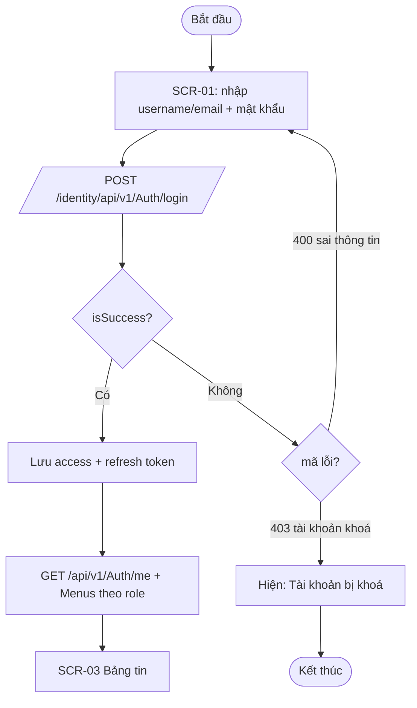
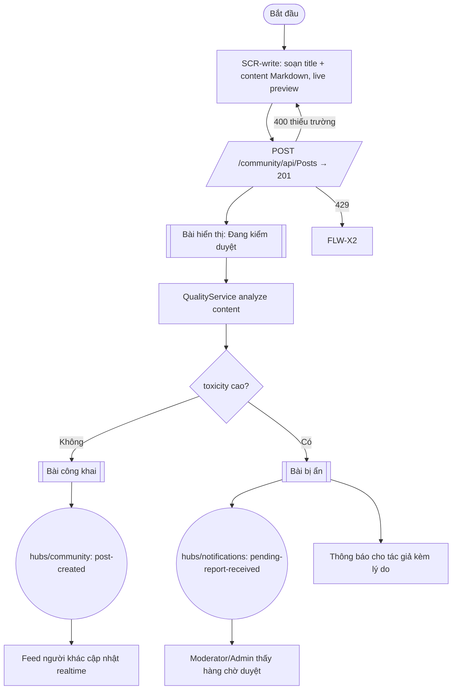

# TÀI LIỆU LUỒNG NGƯỜI DÙNG — DEVRADAR (USER FLOW)

> Template đi kèm [QUY_TRINH_UIUX.md](../QUY_TRINH_UIUX.md) — sinh tự động bằng Prompt P3, dựa trên UI/UX Requirements (P1) + IA (P2).
> Quy ước: ID dạng FLW-xx; mỗi luồng có tiền/hậu điều kiện + Mermaid + bảng bước; bắt buộc ≥ 2 nhánh lỗi/luồng.

---

## 1. Thông tin tài liệu

| Mục | Giá trị |
|---|---|
| Tài liệu | Luồng người dùng (User Flow) |
| Phiên bản / Ngày | 1.0 / <YYYY-MM-DD> |
| Cơ sở | UIUX_Requirements.md; Information_Architecture.md; SRS Chương 3 (14 tiến trình); scripts/run-tests.ps1 |
| Phạm vi | Các luồng [IMPLEMENTED]; luồng [PLANNED] vẽ nhãn rõ, không mô tả như đã chạy được |

## 2. Quy ước ký hiệu (Mermaid)

| Ký hiệu | Ý nghĩa | Cú pháp Mermaid |
|---|---|---|
| `(Bắt đầu)/(Kết thúc)` | Điểm vào/ra | `([văn bản])` |
| Hành động người dùng | Trên màn hình SCR-xx | `["SCR-xx: ..."]` |
| Quyết định | Nhánh điều kiện | `{"câu hỏi?"}` |
| Gọi API | METHOD + path thật | `[/"METHOD path"/]` |
| Nhận sự kiện SignalR | hub + sự kiện | `(("hub: event"))` |
| Trạng thái hệ thống | VD: "Bài đang kiểm duyệt" | `[["trạng thái"]]` |
| Nhánh lỗi | Mã lỗi thật | `-->|"lỗi 401?"| -->` |

> Lưu ý cú pháp: luôn bọc label trong dấu `"` khi chứa `/`, `:`, `()` để Mermaid render chắc chắn.

## 3. Danh mục luồng

| ID | Tên luồng | Tác nhân | UC-xx | SCR xuất phát | Độ phức tạp |
|---|---|---|---|---|---|
| FLW-01 | Đăng nhập | Guest | UC-02 | SCR-01 | Thấp |
| FLW-02 | Đăng ký + OAuth | Guest | UC-01 | SCR-02 | Trung bình |
| FLW-03 | Đăng bài (qua kiểm duyệt AI) | Member+ | UC-15 | SCR-<xx> | Cao |
| FLW-04 | Bình luận & trả lời (realtime) | Member+ | UC-24, UC-25 | SCR-<xx> | Cao |
| FLW-05 | Thích / Bookmark bài viết | Member+ | UC-19, UC-20 | SCR-<xx> | Thấp |
| FLW-06 | Báo cáo vi phạm | Member+ | UC-23, UC-29 | SCR-<xx> | Trung bình |
| FLW-07 | Nhận & đọc thông báo | Member+ | UC-41, UC-42 | SCR-<xx> | Trung bình |
| FLW-08 | Xem Tech Dashboard & Radar | Guest+ | UC-31…34 | SCR-<xx> | Trung bình |
| FLW-09 | Admin xử lý báo cáo | Moderator/Admin | UC-62, UC-63 | SCR-<xx> | Cao |
| FLW-10 | Admin quản trị người dùng | Admin | UC-47…51 | SCR-<xx> | Trung bình |
| FLW-11 | Admin quản trị nội dung | Moderator/Admin | UC-52…61 | SCR-<xx> | Cao |
| FLW-12 | Admin vận hành Crawler | Admin | UC-75…80 | SCR-<xx> | Trung bình |
| FLW-X1 | Hết hạn phiên & refresh token | Mọi role đã đăng nhập | UC-03 | Mọi SCR | Ngang |
| FLW-X2 | Rate limit 429 | Mọi role | — | Mọi SCR | Ngang |
| FLW-X3 | Mất kết nối SignalR | Member+ | — | Mọi SCR realtime | Ngang |

## 4. Chi tiết luồng

### FLW-01 — Đăng nhập (UC-02) [IMPLEMENTED]

- **Tiền điều kiện:** người dùng có tài khoản hoạt động (SRS 3.2).
- **Hậu điều kiện:** hệ thống cấp Access Token + Refresh Token (refresh chỉ dùng 1 lần).
- **Màn hình:** SCR-01 Đăng nhập → SCR-03 Bảng tin.

| # | Hành động UI | Hệ thống | Phản hồi UI | Nhánh lỗi |
|---|---|---|---|---|
| 1 | Nhập thông tin, bấm Đăng nhập | POST /identity/api/v1/Auth/login | Loading nút | 400: giữ form, hiện message |
| 2 | — | Trả token | Lưu storage, chuyển route | — |
| 3 | — | GET /api/v1/Auth/me + Menus | Nạp nav theo role | 401 → FLW-X1 |
| 4 | Bấm OAuth GitHub/Google | POST external-login | Về bảng tin | 400: hiện lỗi provider |

### FLW-03 — Đăng bài qua kiểm duyệt AI (UC-15) [IMPLEMENTED]

- **Tiền điều kiện:** đã đăng nhập, tài khoản hoạt động (SRS 3.4).
- **Hậu điều kiện:** bài lưu community-db, phát sự kiện PostCreatedEvent; QualityService chấm toxicity; nếu vượt ngưỡng bài bị ẩn + thông báo.

| # | Hành động UI | Hệ thống | Phản hồi UI | Nhánh lỗi |
|---|---|---|---|---|
| 1 | Soạn bài, xem preview | — | — | autosave nháp [PLANNED] UC-18 |
| 2 | Bấm Đăng bài | POST /community/api/Posts → 201 | Toast "Đã gửi, đang kiểm duyệt" | 400: highlight trường lỗi |
| 3 | — | QualityService analyze | trạng thái bài theo kết quả | toxicity cao → thông báo tác giả |
| 4 | Quay lại bảng tin | GET /community/api/Posts | Bài của tôi ở trạng thái đúng | — |

> Nhân bản mục này cho từng FLW trong danh mục. Luồng ghi (bài/bình luận) bắt buộc có nhánh kiểm duyệt AI; FLW-X1 phản ánh refresh token 1 lần dùng (refresh fail → logout về SCR-01).

## 5. Luồng ngang (cross-cutting)

| ID | Kịch bản | Hành vi UI bắt buộc |
|---|---|---|
| FLW-X1 | Access token hết hạn (401) | Gọi POST refresh-token; thành công → thử lại request gốc; thất bại (refresh 1 lần đã dùng) → xoá token, về SCR-01 kèm thông báo |
| FLW-X2 | Nhận 429 | Hiện "Quá nhiều yêu cầu, thử lại sau ~1 phút"; khoá nút submit trong khoảng chờ |
| FLW-X3 | SignalR ngắt kết nối | Tự reconnect có backoff; khi offline ẩn badge realtime, hiện "Đang mất kết nối — làm mới để cập nhật" |
| FLW-X4 | Nội dung bị ẩn vì kiểm duyệt | Tác giả thấy trạng thái + lý do; người khác không thấy bài (404/không render) |

## 6. Traceability

| FLW-xx | SCR-xx | UC-xx | API/Event chính |
|---|---|---|---|
| FLW-01 | SCR-01 | UC-02 | POST /identity/api/v1/Auth/login |
| <...> | | | |

## 7. Vấn đề mở (Open Issues)

| # | Vấn đề | Luồng liên quan | Trạng thái |
|---|---|---|---|
| 1 | <VD: UC-04 khôi phục mật khẩu chưa có API> | FLW-02 nhánh quên mật khẩu | [PLANNED] |
